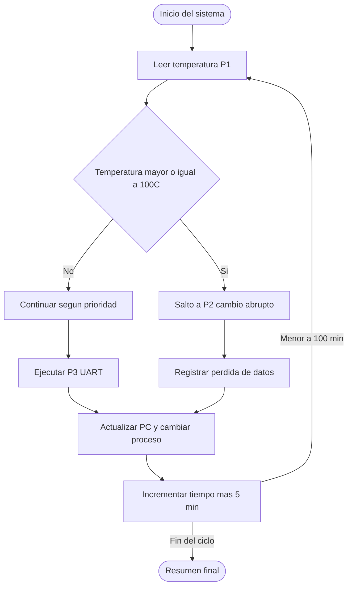

# Escenario 2 – Prioridad impuesta con conmutación y detección de pérdidas

### Proyecto Final – Sistemas Computacionales

**Profesor:** Luz A. Adanaqué  
**Alumnos:** _Marco Soto, Joseph Cabanillas, Gussephe Benjamin_

---

## Descripción general

El Escenario 2 representa la simulación de un _scheduler_ con **prioridades impuestas** en un sistema operativo para un satélite.  
Los procesos ya no se ejecutan de manera secuencial como en el escenario anterior: ahora existe una **jerarquía de prioridad fija (P1 > P3 > P2)**, y el sistema debe ser capaz de **interrumpir procesos**, registrar los cambios y **detectar pérdidas de información** cuando la conmutación ocurre entre procesos no consecutivos.

---

## Objetivos principales

- Implementar un _scheduler preemptivo_ con prioridad fija.
- Detectar y reportar pérdidas de información cuando hay cambios abruptos entre procesos no consecutivos.
- Mantener el mismo ciclo orbital de 100 minutos (42 min zona luminosa y 58 min zona oscura).
- Simular el guardado de _Program Counter (PC)_ en cada cambio de proceso.

---

## Procesos

| Proceso                    | Descripción                                               | Condición   |
| -------------------------- | --------------------------------------------------------- | ----------- |
| **P1 – Sensor**            | Lee temperatura (45–105 °C) según la zona orbital.        | Cada 5 min  |
| **P2 – Enfriamiento**      | Se activa si T>90 °C y se apaga si T<60 °C.               | Condicional |
| **P3 – Comunicación UART** | Transmite la lectura de temperatura y estado del sistema. | Continuo    |

**Orden de prioridad:** `P1 > P3 > P2`

---

## Lógica de funcionamiento

1. **Prioridades impuestas:** El OS ejecuta los procesos según el orden definido.
2. **Eventos anómalos:** Si la temperatura supera 100 °C, se fuerza un salto inmediato a P2 (no consecutivo).
3. **Cambio de contexto:** Se guarda el _program counter_ y se registra la transición.
4. **Pérdidas de información:** Si el proceso interrumpido estaba con datos sin enviar o sin registrar (`dirty`), se contabiliza una pérdida simulada (bytes UART o muestras no consumidas).
5. **Reporte:** El sistema imprime en consola los procesos activos, los cambios de contexto y un resumen final con métricas del scheduler.

---

## Diagrama de flujo



---

## Ejecución del programa

```bash
gcc escenario2.c -o escenario2
./escenario2
```

Para entorno RISC-V:

```bash
riscv64-unknown-elf-gcc -o escenario2 escenario2.c
spike pk escenario2
```

---

## Ejemplo de salida

```
=== ESCENARIO 2: Prioridad impuesta (P1 > P3 > P2) ===

⏱️  t=0 min | Zona=Luminosa
[P1] t=  0 min | Temp=102 C | Zona=Luminosa | pc=1
🔁 Cambio ABRUPTO P1 -> P2 | pérdida=4B
[P2] ⚠️ ACTIVADO (T>90 C)
[OS] UART=0B pend | Cooling=ON

⏱️  t=5 min | Zona=Luminosa
[P2] Estado=ON | pc=2
↔️  Cambio de contexto P2 -> P3
[P3] TX 16B (pendiente= 0B) | pc=1
[OS] UART=0B pend | Cooling=ON

===== RESUMEN =====
Context switches: 12 | Abruptos: 3
Pérdidas (B): P1=8, P3=16, P2=2
```

---

## Observaciones técnicas

- Las conmutaciones se registran con indicador visual (`↔️` normal, `🔁` abrupto).
- Las pérdidas simuladas se basan en datos no transmitidos o muestras no guardadas.
- El sistema sigue la misma estructura orbital del escenario anterior.
- El código mantiene modularidad por procesos (`P1`, `P2`, `P3`) y un _scheduler_ central.

---

## Referencias

- Patterson, D. A., & Hennessy, J. L. (2020). _Computer Organization and Design, RISC‑V Edition._ Morgan Kaufmann.
- Silberschatz, A., Galvin, P. B., & Gagne, G. (2015). _Operating System Concepts._ Wiley.
- Harris, S., & Harris, D. (2021). _Digital Design and Computer Architecture, RISC‑V Edition._ Morgan Kaufmann.
